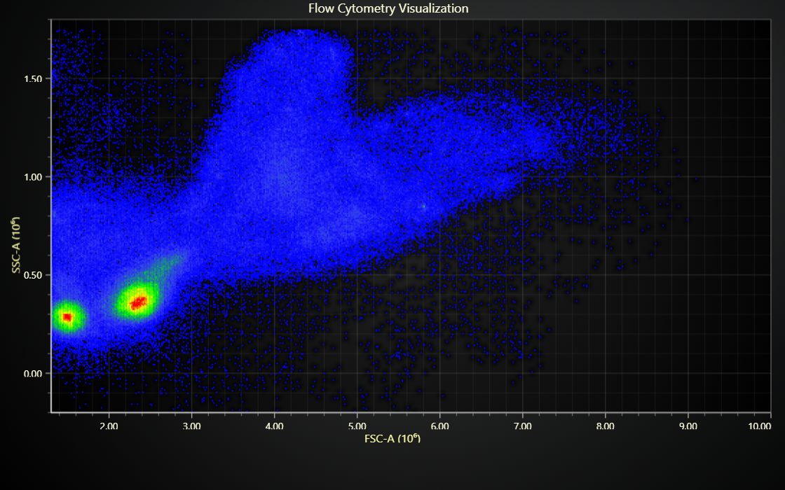

# JavaScript Flow Cytometry Chart

This demo application belongs to the set of examples for LightningChart JS, data visualization library for JavaScript.

LightningChart JS is entirely GPU accelerated and performance optimized charting library for presenting massive amounts of data. It offers an easy way of creating sophisticated and interactive charts and adding them to your website or web application.

The demo can be used as an example or a seed project. Local execution requires the following steps:

-   Make sure that relevant version of [Node.js](https://nodejs.org/en/download/) is installed
-   Open the project folder in a terminal:

          npm install              # fetches dependencies
          npm start                # builds an application and starts the development server

-   The application is available at _http://localhost:8080_ in your browser, webpack-dev-server provides hot reload functionality.

## Description

Flow cytometry is an every-day method in research and clinical practices for analyzing individual cells within heterogeneous samples (like blood sample, for example).

It is based on observing the behavior of pointed light, and can rapidly analyze multiple parameters from each cell.

In this example, all the samples are displayed in a single chart which displays the following information:

-   Forward scatter (FSC). This is measured based on how much light is scattered along the path of the light source.

-   Side scatter (SSC). This is measured based on how much light is scattered at a ninety-degree angle relative to the light source.

Each point in the chart is one sample. When multiple samples have the same SSC and FSC measurement, the point color is adjusted (red = most overlapping samples).

In practice, the data from flow cytometry is filtered through several steps that each look at the relationship between some data attributes. This example is just 1 of these steps.

As an example of this filtering, some application might select some valid range of FSC/SSC values that will be considered in later analysis steps.

## Flow cytometry and LightningChart

The go-to framework for visualizing flow cytometry is definitely "R", a software environment for statistical computing and graphics.

Here are some scenarios where we believe LightningChart is a strong alternative:

1. Real-time data

LightningChart excels at fast changes to data sets, if your application continuously receives data, especially with high rates like several times in second, LightningChart is what you need.

2. Data interactions

In some cases users might need the ability to interact with data (panning, zooming, cursor, etc.). In many statistical tools, this kind of features do not exist since only a minority would have an use for them. Additionally, even if present they might not perform too well especially with large data sets.

3. Deployment in the internet

R is a desktop application. In most cases, users will install it on their own computer and directly interact with data sets to utilize a shared data visualization application.

LightningChart JS, on the other hand, is a web library. LC JS projects can be conveniently embedded inside web pages, mobile and even desktop applications.

## API Links

* [XY cartesian chart]
* [XY axis]
* [Point series]
* [Point shape options]
* [Paletted fill style]
* [Color lookup table]
* [Color factory RGBA]

## Support

If you notice an error in the example code, please open an issue on [GitHub][0] repository of the entire example.

Official [API documentation][1] can be found on [LightningChart][2] website.

If the docs and other materials do not solve your problem as well as implementation help is needed, ask on [StackOverflow][3] (tagged lightningchart).

If you think you found a bug in the LightningChart JavaScript library, please contact sales@lightningchart.com.

Direct developer email support can be purchased through a [Support Plan][4] or by contacting sales@lightningchart.com.

[0]: https://github.com/Arction/
[1]: https://lightningchart.com/lightningchart-js-api-documentation/
[2]: https://lightningchart.com
[3]: https://stackoverflow.com/questions/tagged/lightningchart
[4]: https://lightningchart.com/support-services/

© LightningChart Ltd 2009-2025. All rights reserved.

[XY cartesian chart]: https://lightningchart.com/js-charts/api-documentation/v8.1.0/classes/ChartXY.html
[XY axis]: https://lightningchart.com/js-charts/api-documentation/v8.1.0/classes/Axis.html
[Point series]: https://lightningchart.com/js-charts/api-documentation/v8.1.0/classes/PointLineAreaSeries.html
[Point shape options]: https://lightningchart.com/js-charts/api-documentation/v8.1.0/enums/PointShape.html
[Paletted fill style]: https://lightningchart.com/js-charts/api-documentation/v8.1.0/classes/PalettedFill.html
[Color lookup table]: https://lightningchart.com/js-charts/api-documentation/v8.1.0/classes/LUT.html
[Color factory RGBA]: https://lightningchart.com/js-charts/api-documentation/v8.1.0/functions/ColorRGBA.html

